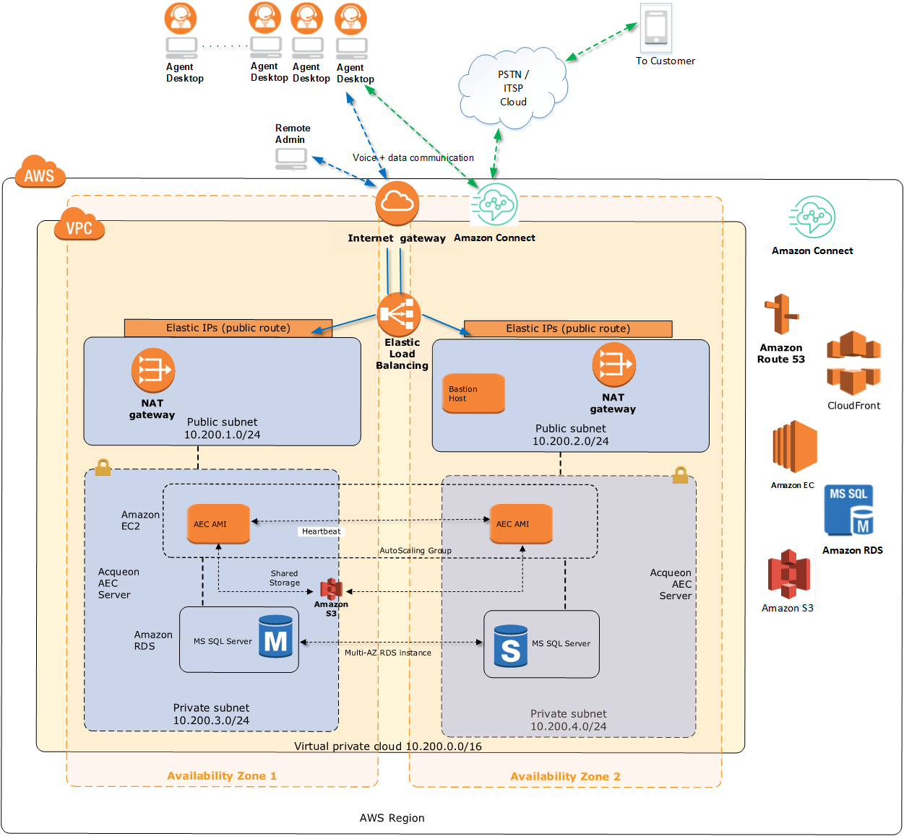

# Acqueon Engagement cloud
AEC is an enhanced outbound voice dialer platform, that natively integrates with Amazon Connect by leaveraging its Agent skilling and voice infrastructure. It provides realtime lead filtering,segmentation, prioritization and scheduling. This helps significantly improve right party connect (RPC) and agent efficiency which aligns with business goals.

This QuickStart configures AWS resources to provide integration between Acqueon Engagement Cloud and Amazon Connect in few easy steps.
You can choose from three deployment options 

The advanced feature includes all in one proactive engagement solution that enables the voice platform with multi channel communication toolsets including email, sms & in-app notifications.This allows you to orchestrate engagements based on user preference, business goals and machine learning.

The AEC platform has built in compliance module for TCPA & OFFCOMM along with DNC scrubing.

Features:
- Dialing Strategy: Support every outbound engagement strategy with dialing and pacing options including: Preview, Progressive and Predictive modes. Adjust campaign pacing for improved agent productivity, compliance with abandonment rate laws and effective use of telephony resources.
- Multi-Channel Support: Provide personalized, proactive customer outreach via voice, SMS (one and two-way), push notifications and email with business rules that define when and how to contact them
Regulatory & Compliance Adherence: Comply with increasingly complex regulatory requirements like TCPA, OFCOM and other governmental regulatory bodies
- DNC Filtering : Do Not Call filtering is supported across all channels(Voice, SMS & email)
- List & Campaign Management: Acqueon Engagement Cloud allows outbound communication to easily create, manage, and fine tune the outbound campaigns over time. Allows to deploy smarter campaigns with options including micro-segmentation, prioritization, auto pilot, centralized attempt, message and regional compliance controls
- Channel Blending: Ability to design campaigns to communicate across multiple channels as part of a single customer interaction. This cross-channel communication is achieved through escalation and blending strategies
- Right Party Connect Optimizer: Leverage right-time and right-mode to-contact capabilities and track contact histories to help design and inform optimal outbound engagement strategies
- Security: End-to-End Encrypted data transmission of customer sensitive data to adhere with customer privacy and security needs. The underlying data storage at rest is also encrypted.

This integration creates the following
- An Amazon EC2 instance with Windows Server 2012 R2 to host AEC core & web applications.
- An Amazon Relational Database Service (Amazon RDS) with Microsoft SQL Server to store,segement, enrich & process the lead list.
It also stores the contact results for reporting, BI & perform advanced analytics to optimize right party contact.
- Amazon EC2 & Amazon RDS High Availability feature supported on Multi Availability Zone
- An Amazon Simple Storage Service (Amazon S3) bucket used to store and upload contact files.
- AEC Agent Desktop for customer screen pop & for setting contact, business disposition.
- SaaS - AEC supports three deployment options for creating additional tenants based on the requirements & deployment options.
- Option-1: Up to 500 Agents 1000 contacts per minute across 100 active campaigns.Max 1 instance(Tenant)
- Option-2: Up to 2000 Agents across all instances 2500 contacts per minute across 300 active campaigns across all instances.Max 6 -- instances(Tenants)
- Option-3: Up to 5000 Agents across all instances 5000 contacts per minute across 600 active campaigns across all instances. 10 instances(Tenants)

